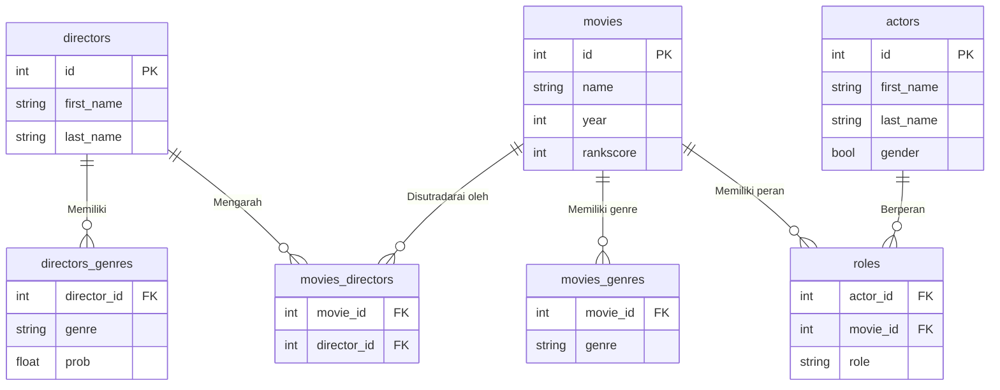

# SQL Query dan Filter

Dokumen ini berisi kumpulan query SQL yang digunakan untuk mengambil data dari basis data film. Setiap query dijelaskan fungsinya agar mudah dipahami dan digunakan kembali.



## 1. Menampilkan Semua Film Setelah Tahun 2000
```bash
SELECT * FROM movies WHERE year > 2000;
```
## 2. Menampilkan Nama Belakang Aktor yang Berakhiran Huruf "s"
```bash
SELECT last_name FROM actors WHERE last_name LIKE '%s';
```

 ## 3. Menampilkan Film dengan Rankscore 5–7 dan Tahun Rilis 2004–2006
 ```bash
SELECT rankscore, year FROM movies 
WHERE rankscore BETWEEN 5 AND 7 
  AND year BETWEEN 2004 AND 2006;
  ```

## 4. Menghitung Jumlah Film dengan Rankscore = 6
```bash
SELECT COUNT(*) AS rankscore_6 FROM movies WHERE rankscore = '6';
```

## 5. Menampilkan Film, Sutradara, dan Genre Sutradara
```bash
SELECT movies.id, movies.name, directors.first_name, dg.genre 
FROM movies
JOIN movies_directors AS md ON md.movie_id = movies.id 
JOIN directors ON md.director_id = directors.id
JOIN directors_genres AS dg ON dg.director_id = directors.id 
LIMIT 50;
```

## 6. Menampilkan Aktor, Film yang Dibintangi, dan Perannya

``` bash
SELECT actors.first_name, movies.name, roles.role 
FROM actors
LEFT JOIN roles ON roles.actor_id = actors.id 
LEFT JOIN movies ON roles.movie_id = movies.id;
```

